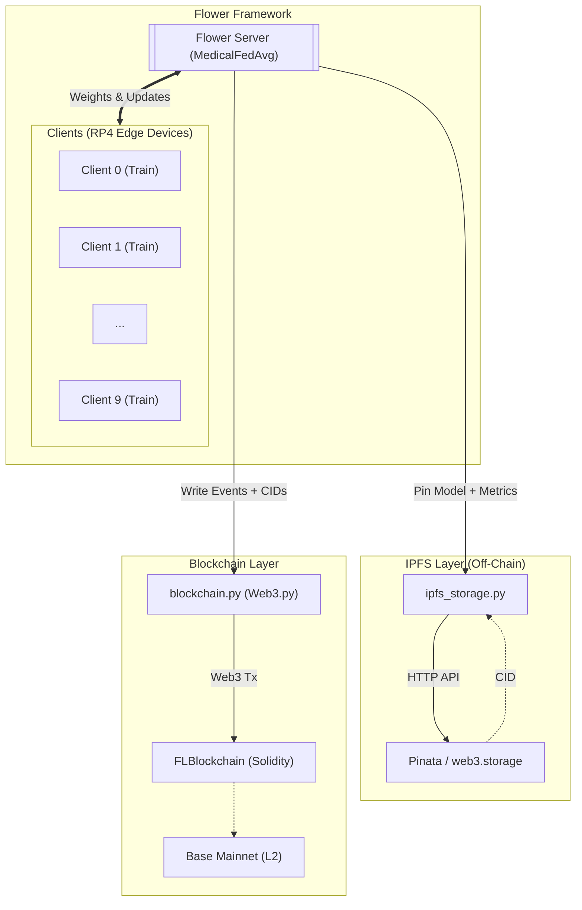

# FLBL2: Real-World Layer-2 Blockchain Auditing for Federated Learning on Edge Hardware

> Federated learning over the **MHEALTH** dataset, deployed across Raspberry Pi 4 edge devices, with a Base mainnet (Ethereum L2) smart-contract ledger for tamper-proof audit of every training round.

---

## Table of Contents

1. [Overview](#overview)
2. [System Architecture](#system-architecture)
3. [Project Structure](#project-structure)
4. [How It Works](#how-it-works)
   - [The Model](#the-model)
   - [Data Pipeline](#data-pipeline)
   - [Federated Learning Loop](#federated-learning-loop)
   - [Blockchain Ledger](#blockchain-ledger)
   - [Voting & Filtering](#voting--filtering)
   - [IPFS Off-Chain Storage](#ipfs-off-chain-storage)
5. [Live Dashboard](#live-dashboard)
6. [Research Background](#research-background)
7. [Requirements](#requirements)
8. [Setup & Installation](#setup--installation)
9. [Configuration](#configuration)
10. [Launching the Experiment](#launching-the-experiment)
11. [Outputs](#outputs)
12. [Blockchain Middleware Optimisation](#blockchain-middleware-optimisation)
13. [Smart Contract](#smart-contract)
14. [Limitations & Future Work](#limitations--future-work)

---

## Overview

This project implements a **federated learning (FL) system** for wearable-sensor human activity recognition (HAR) that records every training event — local model updates, voting decisions, and aggregated global models — to the **Base mainnet** (Ethereum L2) via a custom Solidity smart contract.

**Task:** Classify 23-channel inertial sensor data (accelerometer + gyroscope + magnetometer on chest, right wrist, left ankle) into **12 activities** from the MHEALTH benchmark:

| # | Activity | # | Activity |
|---|---|---|---|
| 1 | Standing still | 7 | Frontal elevation of arms |
| 2 | Sitting and relaxing | 8 | Knees bending (crouching) |
| 3 | Lying down | 9 | Cycling |
| 4 | Walking | 10 | Jogging |
| 5 | Climbing stairs | 11 | Running |
| 6 | Waist bends forward | 12 | Jump front & back |

**10 subjects** participate in the federation on **10 Raspberry Pi 4 edge devices** (one subject per device). A central server aggregates the models each round, performs global evaluation, and writes an immutable summary to the blockchain.

**Training setup:** 10 FL rounds, 10 clients (full participation each round), 1 local epoch per round, `AdamW` lr=0.002.

**Reality check (production-only):** all experiments in this repository use real hardware (RP4), real MHEALTH data, real IPFS pinning, and real Base mainnet transactions.

---

## System Architecture



---

## Project Structure

```
fl_blockchain_evm/
├── client_app.py            # Flower ClientApp (train + evaluate handlers)
├── server_app.py            # Flower ServerApp (aggregation, evaluation, blockchain writes)
├── task.py                  # Flower task helpers
├── utils.py                 # Shared utilities
│
├── core/
│   ├── model.py             # SE-ResNet definition (920K params, 23-ch input, 12 classes)
│   ├── data.py              # MHEALTH loader, windowing, subject partitioning
│   ├── training.py          # train() / evaluate() functions
│   └── constants.py         # Activity labels, dataset constants
│
├── infra/
│   ├── blockchain.py        # Web3 wrapper — fire-and-wait, PerfLogger, BLOCKCHAIN_OPTIMIZED
│   └── ipfs_storage.py      # IPFS off-chain storage (Pinata backend)
│
├── strategy/
│   └── medical_fedavg.py   # MedicalFedAvg — equal-weight FedAvg aggregation
│
├── dashboard/
│   ├── server.py            # FastAPI backend (REST + SSE)
│   ├── fl_dashboard.html    # Live dashboard (topology, metrics, blockchain, IPFS)
│   └── state.py             # Thread-safe dashboard state container
│
└── management/
    ├── server.py            # Management API
    ├── management.html      # Management UI
    └── store.py             # Persistent state store

contracts/
├── FLBlockchain.sol         # Solidity smart contract (deployed via Remix IDE)
└── FLBlockchain_abi.json    # ABI copied from Remix after deployment

data/
└── MHEALTHDATASET/          # MHEALTH dataset (downloaded separately — see Setup)

outputs/                     # Auto-created at runtime
├── results.json             # Per-round metrics (JSONL)
├── perf_baseline_*.log      # Blockchain timing log (BLOCKCHAIN_OPTIMIZED=0)
└── perf_optimized_*.log     # Blockchain timing log (BLOCKCHAIN_OPTIMIZED=1)

final_model.pt               # Saved global model weights after all rounds
pyproject.toml               # Flower project config & hyperparameters
.env                         # Secrets (never commit this)
```

---

## How It Works

### The Model

**`Net`** (`fl_blockchain_evm/core/model.py`) is a 4-stage **SE-ResNet** (Squeeze-and-Excitation Residual Network) for 1-D time-series with **920,013 parameters**:

```
Input: (B, 23, 256)   — batch × 23 sensor channels × 256 time-steps @ 50 Hz
  └─ InputBN
  └─ Stage 1: Conv1d(23→64,  k=7) → BN → ReLU → MaxPool(2) → 2× SEResBlock(64,  k=7)
  └─ Stage 2: Conv1d(64→128, k=5) → BN → ReLU → MaxPool(2) → 2× SEResBlock(128, k=5)
  └─ Stage 3: Conv1d(128→256,k=3) → BN → ReLU → MaxPool(2) → 2× SEResBlock(256, k=3)
  └─ Stage 4: Conv1d(256→512,k=3) → BN → ReLU → MaxPool(2) → 1× SEResBlock(512, k=3)
  └─ GlobalAvgPool → Dropout(0.3) → Linear(512→12)
Output: (B, 12) raw logits — 12-class softmax classification
```

~920K parameters. The SE block applies per-channel attention (squeeze-and-excitation ratio=16) after each residual pair, helping the network focus on the most discriminative sensor channels.

**Loss:** `FocalLoss` (γ=2) — down-weights easy examples and focuses training on hard-to-classify activity transitions.

**Optimizer:** `AdamW` (lr=0.002) with cosine-annealing LR schedule and Mixup augmentation (α=0.3).

**Training augmentations** (applied per mini-batch):
- Mixup (α=0.3) — interpolates pairs of samples to improve generalisation
- Gaussian noise (σ=0.02, p=0.5)
- Per-channel amplitude scaling (×0.9–1.1, p=0.5)

### Data Pipeline

The **MHEALTH dataset** (Banos et al., 2015) contains sensor recordings from 10 healthy subjects performing 12 physical activities. Each subject wears three inertial measurement units (IMU) on the chest, right wrist, and left ankle, providing 23 channels at 50 Hz.

**Subject-based partitioning:**
- **Subjects 1–10** → training federation (one per Raspberry Pi 4 device)

**Windowing:** each subject's time-series is segmented into **256-sample non-overlapping windows** (5.12 seconds at 50 Hz) with 50% stride during loading.

**Normalisation:** per-channel z-score using training statistics computed independently on each subject's data (no data leakage across partitions).

**Class balance:** the MHEALTH dataset is approximately balanced across activities within each subject. No over/under-sampling is required.

### Federated Learning Loop

Each round:

1. **Server** broadcasts the current global model weights to all selected clients.
2. **Each client** receives the weights, fine-tunes for `local-epochs` using its local shard, and returns the updated weights + scalar metrics (loss, samples, training time, active classes).
3. **Server** aggregates via `MedicalFedAvg` — a `FedAvg` variant that forces equal contribution weight (`weight=1`) for every client regardless of shard size, preventing large-shard clients from dominating.
4. **Global evaluation** is performed on the server-side evaluation partition configured for the active run.
5. **Blockchain** records three block types for the round (see below).

### Blockchain Ledger

`EVMBlockchain` (`blockchain.py`) wraps the deployed Solidity contract via **web3.py**. Every round writes the following blocks on-chain:

| Block type | When written | Payload stored |
|------------|-------------|----------------|
| `LOCAL` | After each round (per client) | `client_id`, `train_loss`, `num_examples`, `training_time`, `active_classes` |
| `VOTE` | After each round (per client) | `client_id`, `vote` (ACCEPTED/REJECTED), `reason`, `loss` |
| `GLOBAL` | After each round (global evaluation) | `accuracy`, `f1_macro`, `auc_macro`, `loss`, `num_clients` |

The chain can be integrity-verified at any time via `verifyChain()` on the contract — each block stores the `keccak256` hash of its predecessor.

### Voting & Filtering

Before writing VOTE blocks, the server computes a per-round loss threshold:

```python
threshold = mean(train_losses) + std(train_losses)
```

Clients whose `train_loss > threshold` are marked **REJECTED** on-chain. This is a simple statistical outlier filter — clients with anomalously high loss (potential data quality issues or poisoning) are flagged for auditability, though all clients still contribute to aggregation in this implementation.

---

### IPFS Off-Chain Storage

The system uses **IPFS** (InterPlanetary File System) as a content-addressable off-chain storage layer, optimised for **Raspberry Pi 4** edge devices:

**What is stored on IPFS per round:**

| Artifact | IPFS Key | Approx. Size | Purpose |
|----------|----------|-------------|--------|
| Training metrics | `round_N_local` | ~5 KB | Per-client loss, samples, timing |
| Vote decisions | `round_N_votes` | ~3 KB | Accept/reject verdicts |
| Global model weights | `round_N_global_model` | ~250 KB (gzip) | Full SE-ResNet state_dict |
| Evaluation metrics | `round_N_global_metrics` | ~2 KB | Accuracy, F1, AUC, per-class |

**RP4 design decisions:**
- **No IPFS daemon on devices** — uses Pinata HTTP API (saves ~200 MB RAM vs kubo)
- **Gzip compression** — 200K-param model: 800 KB → ~250 KB
- **BytesIO streaming** — no temp files (avoids SD card wear on RP4)
- **Exponential backoff with jitter** — handles flaky Wi-Fi on edge deployments
- **Graceful degradation** — if IPFS is unreachable, FL training continues normally

**Tamper-proof linkage:** Each on-chain block payload includes the IPFS CID of its detailed off-chain data. Since the blockchain stores `keccak256(payload)`, any modification to either the IPFS content or the CID reference would be detected by `verifyChain()`.

**Supported backends:**

| Backend | Best for | RAM overhead | Setup |
|---------|----------|-------------|-------|
| `pinata` | RP4 devices (recommended) | ~2 MB | Free API key from [Pinata](https://app.pinata.cloud) |
| `web3storage` | Alternative cloud | ~2 MB | Free token from [web3.storage](https://web3.storage) |
| `local` | Server-hosted IPFS | ~200 MB (kubo) | Run `ipfs daemon` on server only |

**Verifying IPFS content:**

```python
from fl_blockchain_evm.ipfs_storage import IPFSStorage

ipfs = IPFSStorage(backend="pinata")

# Fetch a global model checkpoint from any round
sd = ipfs.fetch_model("QmXyz...")  # CID from results.json or on-chain data

# Verify content integrity
assert ipfs.verify_content("QmXyz...", expected_sha256="abc123...")
```

---

## Live Dashboard

The project includes a **real-time dashboard** (`fl_blockchain_evm/dashboard/fl_dashboard.html`) served by a FastAPI backend (`fl_blockchain_evm/dashboard/server.py`). It connects to the running simulation via SSE (Server-Sent Events) and to the Base mainnet blockchain directly.

**Features:**

| Panel | What it shows |
|-------|---------------|
| **Network Topology** | Animated canvas with 10 device nodes, FL server, blockchain node, and IPFS node — live packet animations for weight transfers, blockchain writes, and IPFS pins |
| **Stat Strip** | Round, Accuracy, F1 Macro, AUC Macro, Chain Blocks, IPFS Pins, Active Clients |
| **Client Training Table** | Per-device loss, sample count, duration, active classes, accept/reject vote |
| **Loss Threshold Votes** | Visual bar chart of each client's loss vs. threshold |
| **Metrics History Chart** | Hand-drawn line chart of accuracy, F1, AUC over rounds |
| **Per-Activity F1** | Bar breakdown for all 12 MHEALTH activities |
| **Confusion Matrix** | 5×5 heatmap with intensity shading |
| **Blockchain Ledger** | Live connection to Base mainnet — shows recent blocks (LOCAL/VOTE/GLOBAL), chain validity badge, expandable full history |
| **IPFS Off-Chain Storage** | Active/disabled status, total pin count, per-round CID list with clickable Pinata gateway links |

**Interactive controls:**
- **Round slider** — scrub through historical rounds to inspect past metrics
- **LIVE button** — snap back to the latest round
- **VIEW ALL** — expand the blockchain ledger to show all blocks
- **Node tooltips** — hover over any topology node for detailed state info

---

## Research Background

This system is grounded in three converging research threads:

**Federated learning for HAR on wearable devices.** Trotta et al. (2024) and Arikumar et al. (2022) demonstrate FL across resource-constrained IoT/edge devices for activity recognition but do not address audit transparency or tamper-proofing of the training process. This work extends the paradigm by adding a production blockchain ledger.

**Blockchain-anchored federated learning.** Wu et al. (2026) and Ullah et al. (2025) integrate blockchain into FL to provide immutable records of model updates and voting decisions. Both use permissioned or simulated chains. This system differs by deploying on **Base mainnet** — a public Ethereum L2 — with real gas costs and real transaction latency, providing a fully production-capable audit trail.

**Ethereum Layer-2 for FL middleware.** Base (OP Stack, Ethereum L2) was chosen over L1 Ethereum for its sub-cent transaction fees and 2-second block times, making per-round on-chain writes economically viable. Neiheiser et al. (2023) and Mandal et al. (2023) characterise L2 performance boundaries that informed the 3-transaction-per-round design.

**Key differentiators from prior work:**
- Real production L2 deployment (not testnet or simulation)
- Quantified per-round blockchain middleware overhead with baseline vs. optimised comparison
- Hardware FL on 10 Raspberry Pi 4 devices (subjects 1–10), not simulated edge nodes
- 12-class HAR (MHEALTH) with per-activity AUC reaching 99.9%

---

## Requirements

### Python

```
python >= 3.10
flwr[simulation] >= 1.23
torch >= 2.7
scikit-learn >= 1.3
numpy
pandas
matplotlib
seaborn
web3 >= 6.0
requests >= 2.31
python-dotenv
```

### Other

- **(Optional) IPFS pinning service** for off-chain model storage
  - [Pinata](https://app.pinata.cloud) — free tier: 500 pins, 1 GB (recommended for RP4)
  - Or [web3.storage](https://web3.storage) — free tier: 5 GB
  - Or local IPFS node (kubo) running on the server machine
- **Base mainnet ETH** for gas fees (real ETH, not testnet)
  - Bridge from Ethereum L1 using [https://superbridge.app](https://superbridge.app)
  - You'll need ~0.001–0.005 ETH for a full 10-round session (Base L2 fees are very low)
- **Base main RPC endpoint**
  - Public RPC: `https://main.base.org` (free, no API key needed)
  - Or use Alchemy/Infura for better reliability
- **Base main Network Details**
  - Chain ID: 84532
  - Explorer: [https://main.basescan.org](https://main.basescan.org)
  - Block time: ~2 seconds
  - Gas costs: Very low (L2 benefits)

---

## Setup & Installation

### 1. Clone the repository

```bash
git clone https://github.com/shinratttensei1/FL-Blockchain-EVM.git
cd FL-Blockchain-EVM
```

### 2. Create a virtual environment

```bash
python -m venv .venv
source .venv/bin/activate        # Linux / macOS
# .venv\Scripts\activate         # Windows
```

### 3. Install Python dependencies

```bash
pip install -r requirements.txt .
# or
pip install -r requirements.txt .
```

### 4. Download the MHEALTH dataset

Download the dataset from the [UCI Machine Learning Repository](https://archive.ics.uci.edu/dataset/319/mhealth+dataset) and place it at:

```
data/MHEALTHDATASET/
    mHealth_subject1.log
    mHealth_subject2.log
    ...
    mHealth_subject10.log
    README.txt
```

The loader (`fl_blockchain_evm/core/data.py`) reads the `.log` files directly. No preprocessing is required — windowing and normalisation are handled automatically at load time.

### 5. Deploy the smart contract with Remix

No Hardhat or local Node setup is needed. The contract is deployed directly from the browser using [Remix IDE](https://remix.ethereum.org).

1. Open [https://remix.ethereum.org](https://remix.ethereum.org).
2. Create a new file and paste the contents of `contracts/FLBlockchain.sol`.
3. In the **Solidity Compiler** tab, select compiler version `0.8.20` and compile.
4. In the **Deploy & Run Transactions** tab:
   - Set environment to **Injected Provider - MetaMask** (make sure MetaMask is connected to **Base main**).
   - Click **Deploy**.
5. After deployment, copy the **contract address** from the Remix console.
6. In the **Compilation Details** panel, copy the **ABI** and save it as `FLBlockchain_abi.json` in the project root.

> **Note:** You need real Base mainnet ETH for gas (not testnet). Bridge from Ethereum L1 via [Superbridge](https://superbridge.app).

**To add Base main to MetaMask:**
- Network Name: Base main
- RPC URL: `https://main.base.org`
- Chain ID: 84532
- Currency Symbol: ETH
- Block Explorer: `https://main.basescan.org`

### 6. Configure environment variables

Create a `.env` file in the project root (never commit this file):

```env
BASE_main_RPC_URL=https://main.base.org
PRIVATE_KEY=0x<YOUR_WALLET_PRIVATE_KEY>
CONTRACT_ADDRESS=0x<DEPLOYED_CONTRACT_ADDRESS>

# IPFS off-chain storage (optional — leave IPFS_BACKEND empty to disable)
IPFS_BACKEND=pinata
PINATA_JWT=<YOUR_PINATA_JWT_TOKEN>
# PINATA_GATEWAY=https://gateway.pinata.cloud/ipfs/   # optional override
```

---

## Configuration

All FL hyperparameters live in `pyproject.toml`:

```toml
[tool.flwr.app.config]
num-server-rounds = 10
fraction-train    = 1.0      # all 10 training clients selected each round
local-epochs      = 1
lr                = 0.002
batch-size        = 256
```

The federation runs with **10 SuperNodes** (one per MHEALTH subject/device):

```toml
# local simulation example
[tool.flwr.federations.local-simulation]
options.num-supernodes = 10
options.backend.client_resources.num_cpus = 1
options.backend.client_resources.num_gpus = 0
```

For hardware deployment on Raspberry Pi 4 devices, use the remote federation config and point each device to the SuperLink address.

---

## Launching the Experiment

All commands assume you are in the project root with the virtual environment activated and `.env` populated.

### Run with Flower simulation (recommended for local testing)

```bash
flwr run .
```

This launches a local simulation with 10 virtual clients (one per training subject/device). The blockchain writes are real — each round sends transactions to Base mainnet, so ensure your wallet has sufficient ETH (roughly 0.001 ETH per round).

**What happens during training:**
- Each round writes exactly **3 transactions** to Base main:
  1. `LOCAL` block - aggregated client training data
  2. `VOTE` block - acceptance/rejection decisions
  3. `GLOBAL` block - global model evaluation metrics
- Results are saved to `outputs/results.json` (JSONL format)
- Confusion matrices saved as `outputs/cm_round_N.png`
- Final model saved as `final_model.pt`

### Monitor training with the live dashboard

**Step 1:** Start the dashboard backend server (in a second terminal):

```bash
source venv/bin/activate  # or .venv/bin/activate
python -m fl_blockchain_evm.dashboard.server
```

You should see:
```
INFO:     Started server process
INFO:     Uvicorn running on http://0.0.0.0:8000
```

**Step 2:** Open the dashboard in your browser:

- Open: [http://localhost:8000](http://localhost:8000)

> **Important:** The backend server must be running for the dashboard to display blockchain data and live metrics.

The dashboard shows:
- ✅ Live network topology with animated packet flows (devices → server → blockchain → IPFS)
- 📊 Real-time training metrics (accuracy, F1, AUC) with interactive round slider
- 🎯 Per-client training loss and vote decisions
- 📈 Historical metrics charts
- 🔗 **Blockchain ledger** with live Base main connection and chain validity indicator
- 📡 **IPFS panel** with per-round CID links to Pinata gateway
- 🎨 Confusion matrix heatmap and per-activity F1 bars

> **Tip:** Start the dashboard server before or during training to see live updates. The dashboard connects to Base main to display actual blockchain blocks and reads IPFS CIDs from training results.

### Verify blockchain integrity after the run

```python
from fl_blockchain_evm.blockchain import EVMBlockchain
bc = EVMBlockchain()
print("Chain valid:", bc.verify_chain())
print("Total blocks:", bc.get_chain_length())
bc.print_chain_summary()
```

---

## Outputs

After a successful run the following files are created:

```
outputs/
├── results.json          # JSONL — one JSON object per line, types:
│                         #   "device_training"  — per-round client metrics
│                         #   "client_eval"      — per-round client evaluation
│                         #   "global"           — global eval + ipfs_cids (if enabled)
├── cm_round_1.png        # Confusion matrix heatmap, round 1
├── cm_round_2.png        # ...
└── cm_round_N.png

final_model.pt            # PyTorch state dict of the final global model
```

For the published real-data experiments, this repository already includes full run archives under `outputs/`:

- `baseline_*` directories: 10 full cycles, each cycle = 10 FL rounds
- `optimized_*` directories: 10 full cycles, each cycle = 10 FL rounds
- each run folder includes `experiment_config.json` and `results.json`

When IPFS is enabled, each `"global"` record in `results.json` includes an `ipfs_cids` field:

```json
{
  "type": "global",
  "round": 3,
  "accuracy": 0.812,
  "ipfs_cids": {
    "local_cid": "QmXyz...",
    "vote_cid": "QmAbc...",
    "model_cid": "QmDef...",
    "metrics_cid": "QmGhi..."
  }
}
```

### Reading results

```python
import json

with open("outputs/results.json") as f:
    records = [json.loads(line) for line in f if line.strip()]

global_rounds = [r for r in records if r["type"] == "global"]
for r in global_rounds:
    print(f"Round {r['round']:2d} | "
          f"Acc={r['accuracy']:.3f} | "
          f"F1={r['f1_macro']:.3f} | "
          f"AUC={r['auc_macro']:.3f}")
```

### Reloading the final model

```python
import torch
from fl_blockchain_evm.core.model import Net

model = Net()
model.load_state_dict(torch.load("final_model.pt", map_location="cpu"))
model.eval()
```

## Blockchain Middleware Optimisation

The `EVMBlockchain` class (`fl_blockchain_evm/infra/blockchain.py`) supports two operating modes — **baseline** and **optimised** — controlled by a single environment variable. The primary purpose is to allow a controlled, reproducible comparison of blockchain middleware overhead across FL training runs.

### Enabling the modes

Add this to your `.env` file before running:

```env
# Baseline: every transaction does its own estimate_gas + gas_price RPC calls,
# IPFS uploads block the FL critical path, and verifyChain() runs after each round.
BLOCKCHAIN_OPTIMIZED=0

# Optimised: lazy gas-limit cache, round-level gas_price, async IPFS, deferred verify.
BLOCKCHAIN_OPTIMIZED=1
```

### What changes between modes

| # | Overhead source | Baseline behaviour | Optimised behaviour |
|---|---|---|---|
| **O1** | Gas-limit estimation | `eth_estimateGas` RPC called before **every** transaction (3 calls/round, ~25–45 ms each) | `eth_estimateGas` called **once per block-type** on first use; result × 1.25 headroom is cached and reused for all subsequent rounds → 0 RPC calls from round 1 onwards |
| **O2** | Gas price | `eth_gasPrice` fetched before **every** transaction (3 calls/round, ~15–30 ms each) | Fetched **once per round** at the start of the blockchain pipeline, cached for all 3 transactions |
| **O3** | IPFS uploads | Model checkpoint + metrics uploaded to Pinata **synchronously** on the FL critical path before the transaction is fired (200–800 ms blocking) | Uploads dispatched to **background daemon threads** immediately; the blockchain transaction is fired without waiting. Upload finishes during the 10–30 s on-chain confirmation window → 0 ms added to critical path |
| **O4** | Chain verification | `verifyChain()` called on-chain **after every round** (grows as O(N) with chain length) | `verifyChain()` **deferred to session end** only — runs once inside `print_chain_summary()` |

> Both modes produce **identical semantic outputs**: 3 transactions per round, the same IPFS artifacts, the same on-chain data. Only timing and blocking behaviour differ.

### Performance logger

Every run — regardless of mode — automatically creates a structured timing log in `outputs/`:

```
outputs/perf_baseline_YYYYMMDD_HHMMSS.log   (when BLOCKCHAIN_OPTIMIZED=0)
outputs/perf_optimized_YYYYMMDD_HHMMSS.log  (when BLOCKCHAIN_OPTIMIZED=1)
```

**Log format** (one entry per event, with sub-millisecond timestamps):

```
HH:MM:SS.ffffff  === FL-Blockchain Performance Log ===
HH:MM:SS.ffffff  Mode     : BASELINE | OPTIMIZED
HH:MM:SS.ffffff  Started  : 2026-04-21T15:43:27.123456
HH:MM:SS.ffffff  --------------------------------------------------
HH:MM:SS.ffffff  --- ROUND 1 start  mode=BASE
HH:MM:SS.ffffff    gas_limit  type=LOCAL   estimated=81432  estimate_ms=32.1
HH:MM:SS.ffffff    gas_price  fetched=1500000  fetch_ms=18.4
HH:MM:SS.ffffff    tx_sent    type=LOCAL   hash=0xabc123...  send_ms=8.1
HH:MM:SS.ffffff    gas_limit  type=VOTE    estimated=74512  estimate_ms=28.7
HH:MM:SS.ffffff    gas_price  fetched=1500000  fetch_ms=19.2
HH:MM:SS.ffffff    tx_sent    type=VOTE    hash=0xdef456...  send_ms=7.9
HH:MM:SS.ffffff    gas_limit  type=GLOBAL  estimated=118640  estimate_ms=41.3
HH:MM:SS.ffffff    gas_price  fetched=1502000  fetch_ms=21.0
HH:MM:SS.ffffff    tx_sent    type=GLOBAL  hash=0x789abc...  send_ms=9.4
HH:MM:SS.ffffff    confirmed  idx=0  block=44901234  submit_to_confirm_ms=12450
HH:MM:SS.ffffff    confirmed  idx=1  block=44901235  submit_to_confirm_ms=14100
HH:MM:SS.ffffff    confirmed  idx=2  block=44901238  submit_to_confirm_ms=18320
HH:MM:SS.ffffff    wait_for_pending  n=3  total_wait_ms=18350
HH:MM:SS.ffffff  --- ROUND 1 end  total_overhead_ms=18612
```

In optimised mode, `estimate_ms` lines are replaced by `cached=<value>  saved_rpc_ms=~30` and gas_price shows `cached=<value>  saved_rpc_ms=~20`, making it straightforward to diff the two log files.

### Running a comparison

```bash
# Run 1 — baseline
BLOCKCHAIN_OPTIMIZED=0 flwr run .
# Produces: outputs/perf_baseline_<timestamp>.log

# Run 2 — optimised
BLOCKCHAIN_OPTIMIZED=1 flwr run .
# Produces: outputs/perf_optimized_<timestamp>.log

# Quick comparison (total overhead per round)
grep "ROUND.*end" outputs/perf_baseline_*.log
grep "ROUND.*end" outputs/perf_optimized_*.log
```

---

## Smart Contract

**`contracts/FLBlockchain.sol`** — deployed on Base mainnet.

Inherits from OpenZeppelin's `Ownable` and `Pausable`. Key design decisions:

- **Genesis block** is created at deployment with a fixed hash, anchoring the chain.
- `addBlock(flRound, blockType, data)` — hashes `data` with `keccak256`, chains to the previous block's hash, emits a `BlockAdded` event. The contract owner (the server wallet) can write any block type; authorized clients can only write `LOCAL` blocks.
- `verifyChain()` — iterates all blocks and checks `blocks[i].previousHash == blocks[i-1].contentHash`. Returns `false` if any tampering is detected.
- `pause()` / `unpause()` — emergency stop controlled by the owner.

```
Functions:
  authorizeClient(address)   onlyOwner
  revokeClient(address)      onlyOwner
  addBlock(uint, string, bytes) → uint    whenNotPaused
  getBlock(uint) → Block
  getBlockCount() → uint
  verifyChain() → bool
  getLatestBlock() → Block
  pause() / unpause()        onlyOwner
```

The Python wrapper (`fl_blockchain_evm/infra/blockchain.py`) serializes all metadata as JSON, encodes it to `bytes`, and calls `addBlock`. Only the `keccak256` hash of the payload is stored on-chain; the raw data is not.

---
